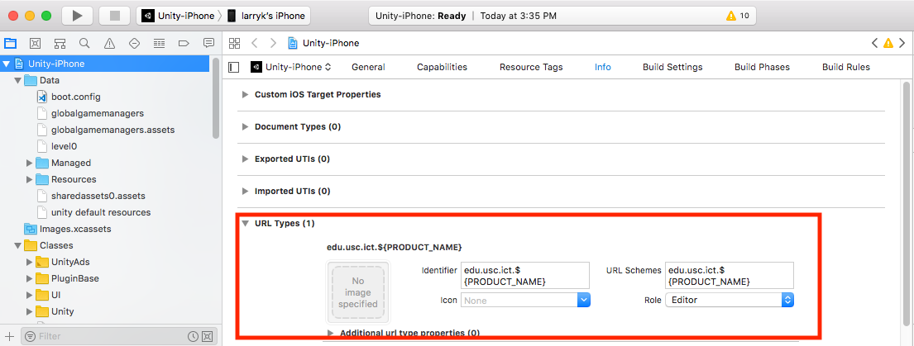

Makes your Unity iOS app launchable via a url scheme.
By default, sets the url scheme to be the fully qualified product name, e.g. `com.yourcompany.yourapp`.

So if you're using, say, the App Launcher plugin from the Unity Asset store
(https://assetstore.unity.com/packages/tools/integration/app-launcher-20454)

...then you would use this line of code to launch your app from another unity app:

```csharp
AppLauncher.LaunchApp("com.yourcompany.yourapp://", "NameOfYourGameObjectForOnSuccessOnErrorCallbacks");
```

## Install

From your unity project folder:

    npm init --force # only if you don't yet have a package.json for your unity proj
    npm install beatthat/unity-ios-app-make-launchable --save

## Usage

Once this package is installed, it should just automatically set the necessary plist properties to make your app launchable on every build.

To verify in XCode that it worked, look at Info/UrlType. There should be one URL Type entry like the below.



